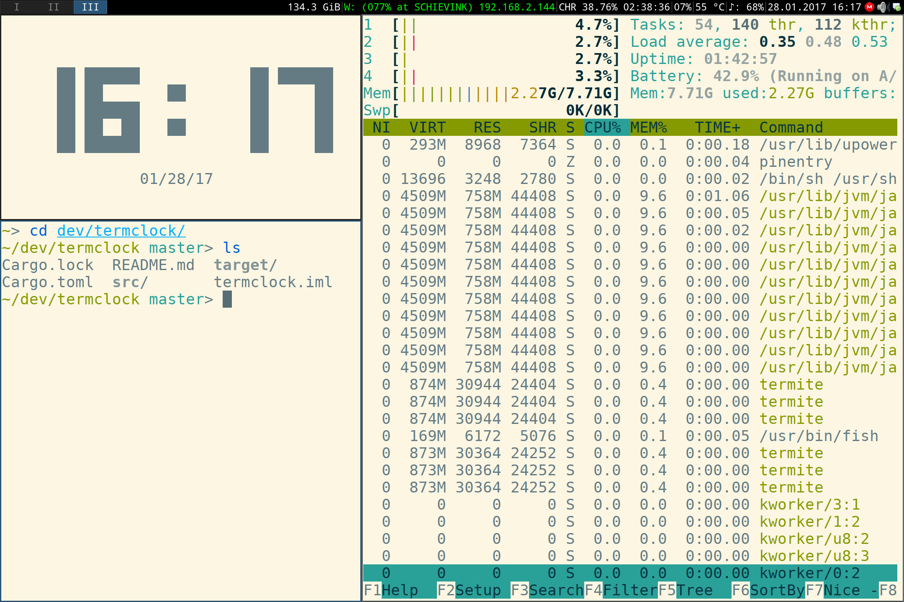

# Termclock

Termclock is a very simple but beautiful clock for your terminal. By default, it will display the time in big letters as well as the date in normal text below.

## Install

Termclock isn't yet available in any distribution, but it *is* published on [crates.io](https://crates.io/).

You need to have [Rust](http://rust-lang.org) installed. Install Termclock by running:

    cargo install termclock

Happy ricing!

## Platform support

The primary target platform is, of course, Linux, but in theory Termclock should work on any platform supported by Rust and ncurses.

Since the ncurses wrapper used by Termclock, [pancurses](https://github.com/ihalila/pancurses), also claims to support Windows, it should be possible to get Termclock running there, too. Yay for cross-platform ricing!

## Screenshot

